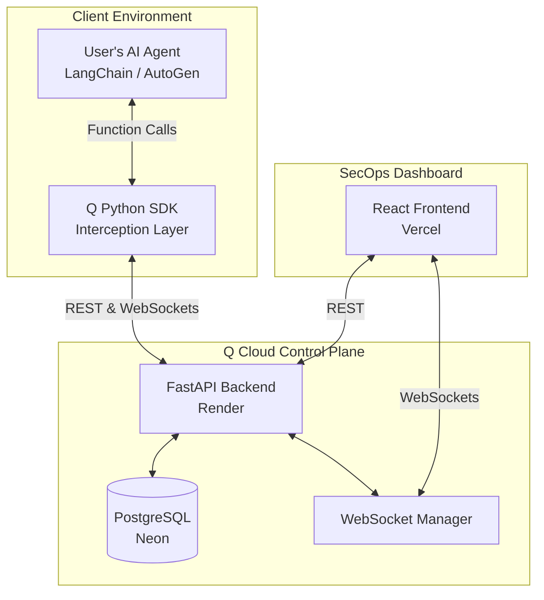

# Q Platform Architecture & Tech Stack

"Q" is an enterprise-grade security and governance control plane for autonomous AI agents. 

Think of it like **Kubernetes for AI**. As companies give AI agents API keys, database access, and the ability to execute code, Q sits in the middle to ensure they don't go rogue. It tracks everything they do, detects anomalies, and forces high-risk actions to wait for a human to click "Approve."

Here is a complete breakdown of the platform we've built together.

---

## 1. The High-Level Architecture

## 2. The Tech Stack Breakdown

### The Agent SDK (Python)
This is the library developers install (`pip install q-agent-sdk`) into their existing AI agents.
*   **Language:** Python 3.10+
*   **Networking:** `httpx` for reliable HTTP requests and WebSockets.
*   **Core Logic:** It uses Python decorators (e.g., `@agent.tool`) to wrap the agent's functions. When an agent tries to use a high-risk tool (like `transfer_funds`), the SDK freezes the Python thread, sends a request to the backend, and waits for human approval.
*   **Resiliency:** Built-in exponential backoff and connection pooling so it never crashes the host application.

### The Backend (FastAPI)
The central nervous system of Q, currently deployed on Render.
*   **Framework:** **FastAPI** (Python). Chosen for its extreme speed and native support for async/WebSockets.
*   **Database:** **PostgreSQL** hosted on Neon, connected via **SQLAlchemy** (ORM).
*   **Real-time Comms:** Native FastAPI WebSockets. This is what allows the dashboard to pop up an approval card in milliseconds the moment an agent tries to execute code.
*   **Security:** `slowapi` for rate-limiting, custom cryptographic API key hashing, and background anomaly detection to spot rogue agents.

### The Frontend (React + Vite)
The "Mission Control" dashboard used by human security operators, currently deployed on Vercel.
*   **Framework:** **React.js** built with **Vite** (for fast compilation).
*   **Styling:** Modern CSS, dark mode, and glassmorphism UI elements to look like a premium cybersecurity product.
*   **Reactivity:** Real-time WebSocket listeners instantly update the UI when agents emit telemetry or require approvals.

---

## 3. The "Moat" (Core Security Features)
We spent a lot of time building enterprise-grade security features that make Q robust against actual AI hacking:

1.  **Tamper Resistance:** If a rogue AI agent realizes it's being monitored and tries to dynamically delete the `@agent.tool` decorator to bypass approvals, the SDK detects the runtime modification and permanently halts execution.
2.  **TOCTOU Prevention (Time-Of-Check to Time-Of-Use):** The SDK mathematically verifies that the exact arguments the human approved on the dashboard are the *exact same* arguments the agent is executing. The agent cannot swap variables at the last millisecond.
3.  **Graceful Degradation:** If the FastAPI backend goes offline, the SDK gracefully catches the errors, logs a warning, and "fails open" (or closed, depending on configuration) instead of crashing the user's expensive AI pipeline.
4.  **State Exhaustion Protection:** The database uses an SQLAlchemy `QueuePool` with a fast timeout. If 1,000 agents hit the platform at once, it cleanly rejects overflow traffic with a `429 Too Many Requests` error, forcing the agents to exponentially back off instead of crashing the database.
