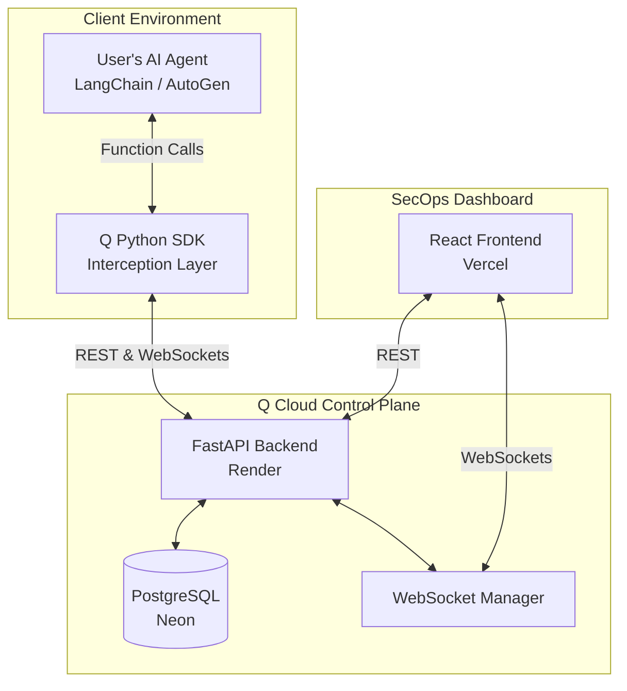

# Q — Agentic AI Security & Governance Platform

> *The name's Q. I give the agents their tools... and I make sure they don't misuse them.*

**Q** is the security and governance control plane for autonomous AI agents — the same way Kubernetes governs containers, Q governs AI agents.

    

---

## The Problem

Every enterprise is deploying autonomous AI agents. But:
- **79% lack governance frameworks** for these agents (Deloitte, 2026)
- Non-human identities outnumber humans **45:1 to 144:1** in enterprise environments
- Only **15-28% of organizations** can track what their AI agents are doing
- A single compromised agent credential can execute a **full kill chain without malware**

## The Solution

Q provides end-to-end security governance for AI agents with enterprise-grade protections built-in:

| Feature | What It Does |
|---|---|
| **Human-In-The-Loop (HITL)** | Pauses agent thread execution for high-risk tools and awaits WebSockets human approval. |
| **Tamper Resistance** | SDK detects if a rogue agent dynamically deletes security decorators and permanently halts execution. |
| **TOCTOU Protection** | Cryptographically verifies that the arguments approved by a human were not swapped out by the agent at the last millisecond. |
| **Circuit Breakers** | Built-in exponential backoff means if the Q control plane is temporarily unavailable, the SDK recovers gracefully without crashing the user's host application. |
| **State Exhaustion Defense** | Backend database connection pooling (`QueuePool`) blocks DDOS attacks from runaway agents, emitting `429 Too Many Requests`. |
| **Real-Time Monitoring** | Tracks every tool call, LLM invocation, and data access in real-time. |
| **Anomaly Detection** | OWASP-based background analysis detects prompt injections, privilege escalation, and goal hijacking. |

## Architecture



## Quick Start (Investor Demo via Colab)

Want to see Q in action without installing anything?
1. Open the [Q Dashboard](https://q-vert-eight.vercel.app/) and navigate to the **HITL Gateway**.
2. Open a new [Google Colab Notebook](https://colab.research.google.com/) and paste this:
```python
!pip install -q git+https://github.com/rajdeeppal01/Q.git#subdirectory=sdk

from q_sdk import QAgent
import time

# Connect to the live Q Control Plane
agent = QAgent(
    name="my-first-agent", 
    api_key="q_sk_demo_key_123"
)

@agent.tool(risk_level="high", require_approval=True)
def transfer_funds(user_id, amount):
    time.sleep(1)
    return f"Transferred ${amount} to {user_id}"
    
print("Agent executing...")
# The SDK will freeze execution here until you click 'Approve' on the dashboard!
result = transfer_funds("usr_999", 5000)
print(f"Result: {result}")
```

## Local Development

### Backend
```bash
cd backend
python -m venv venv
venv\Scripts\activate          # Windows
pip install -r requirements.txt
# Create .env (see .env.example)
uvicorn app.main:app --reload --port 8000
```

### Frontend
```bash
cd frontend
npm install
npm run dev
```

### SDK
```bash
pip install -e ./sdk
```

## Compliance Framework Mappings

- **OWASP Agentic Top 10** (ASI01–ASI10): Goal hijacking, tool misuse, privilege abuse, rogue agents
- **NIST AI RMF**: Govern, Map, Measure, Manage
- **ISO 42001**: AI policies, lifecycle, data governance, third-party risk

## Author

**Rajdeep Pal** — 4th Year BTech CSE (Cybersecurity)

---

*Named after Q from James Bond — the quartermaster who equips agents with tools and ensures they're used responsibly.*
