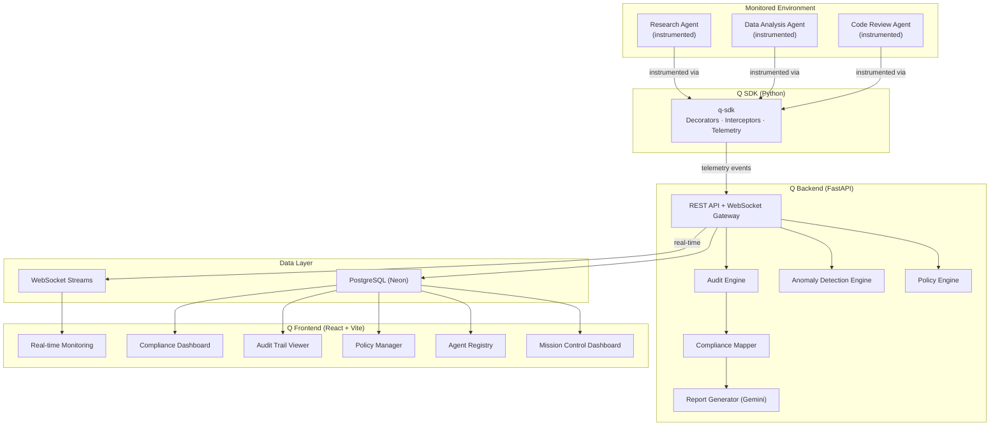
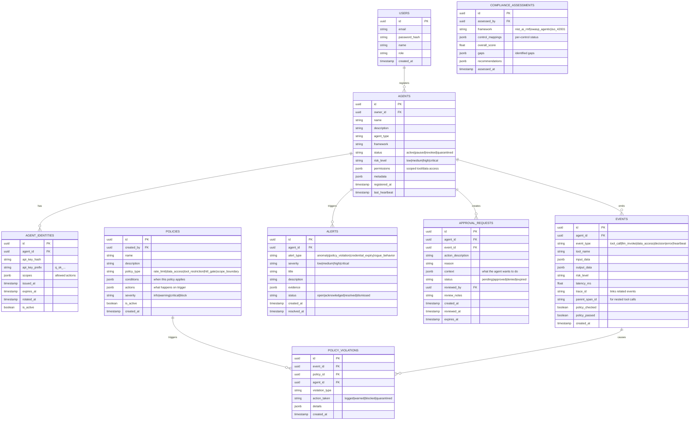
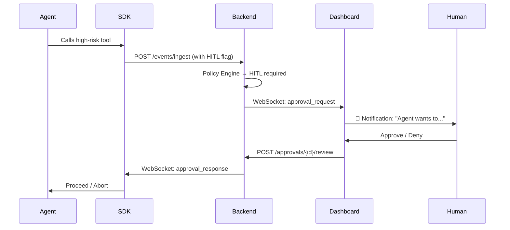

# Q — Agentic AI Security & Governance Platform

## Implementation Plan

> **Q** (named after the James Bond quartermaster) — a platform that acts as the security and governance control plane for autonomous AI agents, the same way Kubernetes is the control plane for containers.

---

## Architecture Overview



### Core Concept: The SDK-First Approach

The entire platform hinges on one design decision: **a lightweight Python SDK** (`q-sdk`) that wraps around any AI agent. This is inspired by how OpenTelemetry instruments microservices — transparent, non-invasive, and framework-agnostic.

When a developer instruments their agent with `q-sdk`:
- Every **tool call** is intercepted, logged, and policy-checked before execution
- Every **LLM invocation** is traced with full input/output context
- Every **data access** is recorded with scope validation
- **High-risk actions** can be paused for human approval (HITL gate)
- All events stream to the Q backend in real-time

```python
# What instrumenting an agent looks like (developer experience)
from q_sdk import QAgent, tool, require_approval

agent = QAgent(
    name="financial-analyst",
    q_url="http://localhost:8000",
    api_key="q_sk_..."
)

@agent.tool(risk_level="high", data_classification="pii")
@require_approval(reason="Accesses customer financial data")
def query_customer_database(customer_id: str) -> dict:
    """Query the customer database for financial records."""
    return db.query(customer_id)

@agent.tool(risk_level="low")
def search_web(query: str) -> str:
    """Search the web for information."""
    return search_api.search(query)

# When the agent runs, Q captures everything
agent.run("Analyze customer #1234's portfolio risk")
```

---

## Tech Stack

| Layer | Technology | Rationale |
|---|---|---|
| **SDK** | Pure Python (no framework lock-in) | Must work with LangChain, CrewAI, custom agents, or bare API calls |
| **Backend** | FastAPI + SQLAlchemy + Alembic | Async, WebSocket support, your existing expertise from TrackrAI |
| **Database** | PostgreSQL (Neon) with JSONB columns | Structured data + flexible event payloads; free tier for demo |
| **Real-time** | WebSocket (native FastAPI) | Live monitoring dashboard, HITL approval gates |
| **AI** | Google Gemini 2.5 Flash | Anomaly analysis, compliance report generation, natural language policy descriptions |
| **Frontend** | React 19 + Vite + Tailwind CSS v4 | Your existing skills; premium cybersecurity-themed dark UI |
| **Animations** | Framer Motion | Consistent with TrackrAI; springy micro-animations |
| **Charts** | Recharts + custom D3 for agent graph | Network topology visualization for inter-agent communication |
| **Auth** | JWT (HS256) + API Keys for agents | Human users get JWT; agents get scoped API keys |

---

## Project Structure

```
c:\Users\rajde\OneDrive\Desktop\projects\q\
├── sdk/                          # q-sdk Python package
│   ├── q_sdk/
│   │   ├── __init__.py
│   │   ├── client.py             # QAgent class — core SDK
│   │   ├── interceptors.py       # Tool call / LLM interceptors
│   │   ├── policy.py             # Client-side policy enforcement
│   │   ├── telemetry.py          # Event emission to backend
│   │   ├── models.py             # Pydantic event schemas
│   │   └── decorators.py         # @tool, @require_approval, etc.
│   ├── setup.py
│   └── README.md
│
├── backend/                      # FastAPI backend
│   ├── app/
│   │   ├── main.py               # FastAPI app entry + WebSocket
│   │   ├── config.py             # Settings & environment
│   │   ├── database.py           # SQLAlchemy + Neon connection
│   │   ├── models/               # SQLAlchemy ORM models
│   │   │   ├── agent.py          # Agent registry model
│   │   │   ├── event.py          # Telemetry event model
│   │   │   ├── policy.py         # Governance policy model
│   │   │   ├── identity.py       # Agent identity / credentials
│   │   │   ├── alert.py          # Security alert model
│   │   │   ├── approval.py       # HITL approval request model
│   │   │   └── user.py           # Human user model
│   │   ├── routes/
│   │   │   ├── agents.py         # Agent CRUD + registry
│   │   │   ├── events.py         # Telemetry ingestion
│   │   │   ├── policies.py       # Policy CRUD + enforcement
│   │   │   ├── identities.py     # IAM — keys, permissions, rotation
│   │   │   ├── monitoring.py     # Real-time monitoring + alerts
│   │   │   ├── audit.py          # Audit trail queries
│   │   │   ├── compliance.py     # Compliance mapping + reports
│   │   │   ├── approvals.py      # HITL approval workflow
│   │   │   └── auth.py           # Human user authentication
│   │   ├── services/
│   │   │   ├── anomaly.py        # Anomaly detection engine
│   │   │   ├── policy_engine.py  # Policy evaluation logic
│   │   │   ├── compliance_mapper.py  # NIST/OWASP/ISO mapper
│   │   │   └── report_generator.py   # Gemini-powered reports
│   │   └── websocket/
│   │       └── manager.py        # WebSocket connection manager
│   ├── alembic/                  # Database migrations
│   ├── requirements.txt
│   └── .env
│
├── frontend/                     # React dashboard
│   ├── src/
│   │   ├── pages/
│   │   │   ├── Dashboard.jsx         # Mission control overview
│   │   │   ├── AgentRegistry.jsx     # All agents + status
│   │   │   ├── AgentDetail.jsx       # Single agent deep dive
│   │   │   ├── LiveMonitor.jsx       # Real-time event stream
│   │   │   ├── PolicyManager.jsx     # Create/edit policies
│   │   │   ├── AuditTrail.jsx        # Searchable audit log
│   │   │   ├── Compliance.jsx        # NIST/OWASP/ISO dashboards
│   │   │   ├── Approvals.jsx         # Pending HITL approvals
│   │   │   ├── Alerts.jsx            # Security alerts
│   │   │   └── Login.jsx             # Authentication
│   │   ├── components/
│   │   │   ├── AgentCard.jsx         # Agent summary card
│   │   │   ├── EventStream.jsx       # Live scrolling events
│   │   │   ├── AgentGraph.jsx        # D3 network topology
│   │   │   ├── RiskGauge.jsx         # Animated risk score gauge
│   │   │   ├── ComplianceRadar.jsx   # Radar chart for frameworks
│   │   │   ├── PolicyEditor.jsx      # Visual policy builder
│   │   │   ├── ApprovalModal.jsx     # HITL approve/deny modal
│   │   │   ├── AuditTimeline.jsx     # Vertical timeline
│   │   │   └── Sidebar.jsx           # Navigation
│   │   ├── context/
│   │   │   ├── AuthContext.jsx
│   │   │   └── WebSocketContext.jsx  # Real-time event context
│   │   ├── api/
│   │   │   └── axios.js              # API client
│   │   ├── hooks/
│   │   │   ├── useWebSocket.js       # WebSocket hook
│   │   │   └── useAgents.js          # Agent data hook
│   │   ├── App.jsx
│   │   ├── main.jsx
│   │   └── index.css                 # Design system
│   ├── package.json
│   └── vite.config.js
│
├── demo-agents/                  # Demo agents instrumented with SDK
│   ├── research_agent.py         # Web research agent
│   ├── data_analyst_agent.py     # Financial data analysis agent
│   ├── code_review_agent.py      # Code review agent (with risky behavior)
│   └── requirements.txt
│
├── docs/
│   ├── architecture.md
│   ├── sdk-guide.md
│   └── compliance-mappings.md
│
└── README.md
```

---

## Database Schema



---

## Implementation Phases

### Phase 1: Foundation (Days 1–3)
> Project scaffolding, database, core models, authentication

- [x] Create monorepo structure at `c:\Users\rajde\OneDrive\Desktop\projects\q\`
- [x] Initialize backend (FastAPI + SQLAlchemy + Alembic)
- [x] Initialize frontend (Vite + React 19 + Tailwind v4)
- [x] Initialize SDK (Python package with setup.py)
- [x] Set up PostgreSQL (Neon) and create database schema
- [x] Implement user authentication (JWT)
- [x] Create base API structure with CORS, error handling, rate limiting

---

### Phase 2: Agent SDK (Days 4–7)
> The heart of the platform — the instrumentation layer

**Core SDK Components:**

```python
# q_sdk/client.py — The QAgent class
class QAgent:
    """Main SDK class. Wraps any AI agent with Q instrumentation."""
    
    def __init__(self, name, q_url, api_key):
        self.name = name
        self.api_key = api_key
        self._telemetry = TelemetryClient(q_url, api_key)
        self._policy_cache = PolicyCache()
        self._tools = {}
    
    def tool(self, risk_level="low", data_classification=None):
        """Decorator to register and instrument a tool."""
        def decorator(func):
            # Wrap function to intercept calls
            @wraps(func)
            async def wrapper(*args, **kwargs):
                # 1. Create event
                event = ToolCallEvent(
                    agent_id=self.id,
                    tool_name=func.__name__,
                    input_data=serialize(args, kwargs),
                    risk_level=risk_level,
                    data_classification=data_classification,
                )
                # 2. Check policy BEFORE execution
                policy_result = await self._check_policy(event)
                if policy_result.action == "block":
                    raise PolicyViolationError(policy_result)
                if policy_result.action == "require_approval":
                    await self._request_approval(event)
                # 3. Execute the actual tool
                result = await func(*args, **kwargs)
                # 4. Record output + emit telemetry
                event.output_data = serialize(result)
                await self._telemetry.emit(event)
                return result
            return wrapper
        return decorator
```

- [ ] Implement `QAgent` core class
- [ ] Implement tool interception decorators (`@agent.tool`)
- [ ] Implement `@require_approval` decorator for HITL gates
- [ ] Implement `TelemetryClient` (HTTP + WebSocket emission)
- [ ] Implement `PolicyCache` (client-side policy caching)
- [ ] Implement event serialization (Pydantic models)
- [ ] Implement LLM call interception (wrap common providers)
- [ ] Create `setup.py` for pip-installable package
- [ ] Write SDK documentation with usage examples

---

### Phase 3: Agent Registry & Identity Management (Days 8–11)
> Non-human IAM — the cybersecurity core

**Registration Flow:**
1. Human user registers an agent via API/dashboard
2. Q generates a unique agent identity (UUID) and API key
3. Permissions are scoped: which tools, which data classifications, which actions
4. API key has an expiration policy and rotation schedule

**Key Features:**
- [ ] Agent registration API (POST `/agents/register`)
- [ ] Agent CRUD (list, get, update, deactivate, quarantine)
- [ ] API key generation with cryptographic hashing (store hash, return key once)
- [ ] Permission scoping system (JSON-based permission definitions)
- [ ] API key rotation endpoint (POST `/identities/{id}/rotate`)
- [ ] Key expiry tracking and alerts
- [ ] Agent status management (active → paused → revoked → quarantined)
- [ ] Agent heartbeat mechanism (agents ping to confirm liveness)
- [ ] Agent metadata tagging (framework, purpose, team, environment)

---

### Phase 4: Behavioral Monitoring & Anomaly Detection (Days 12–17)
> Real-time visibility into what every agent is doing

**Event Ingestion Pipeline:**
1. SDK emits events via HTTP POST or WebSocket
2. Backend validates event against agent identity
3. Event is persisted to PostgreSQL
4. Event is broadcast to monitoring WebSocket channel
5. Anomaly detection runs asynchronously

**Anomaly Detection Strategy:**
- **Statistical baselines:** Track per-agent metrics (tool call frequency, error rate, data volume accessed). Flag deviations beyond 2σ.
- **Pattern matching:** Detect known attack patterns from OWASP Agentic Top 10 (e.g., tool misuse, privilege escalation, memory poisoning attempts)
- **AI-powered analysis:** For complex anomalies, send event sequences to Gemini for semantic analysis ("Does this sequence of actions suggest goal hijacking?")

- [ ] Telemetry ingestion endpoint (POST `/events/ingest`)
- [ ] WebSocket gateway for real-time event streaming
- [ ] Event validation and agent identity verification
- [ ] Statistical baseline calculator (rolling averages per agent)
- [ ] Anomaly detection rules engine
- [ ] OWASP pattern matching (ASI01–ASI10 signatures)
- [ ] Alert generation and severity classification
- [ ] Gemini integration for semantic anomaly analysis
- [ ] Alert management API (acknowledge, resolve, dismiss)

---

### Phase 5: Policy Engine (Days 18–22)
> Define, enforce, and audit governance policies

**Policy Types:**

| Policy Type | Example | Enforcement |
|---|---|---|
| **Rate Limit** | "Agent X can make max 100 tool calls per hour" | Block + alert after limit |
| **Data Access** | "No agent can access PII without approval" | HITL gate |
| **Tool Restriction** | "Agent Y cannot use the `delete_file` tool" | Block at runtime |
| **HITL Gate** | "Any action with risk_level=critical requires human approval" | Pause agent, notify humans |
| **Scope Boundary** | "Agent Z can only access data from the `marketing` schema" | Block + quarantine |
| **Time Boundary** | "Agents can only operate during business hours (9AM–6PM IST)" | Block outside hours |

**Human-in-the-Loop (HITL) Approval Flow:**


- [ ] Policy CRUD API (create, list, update, deactivate)
- [ ] Policy condition DSL (JSON-based rule definitions)
- [ ] Runtime policy evaluation engine
- [ ] HITL approval workflow (request → notify → review → respond)
- [ ] WebSocket notification for pending approvals
- [ ] Approval timeout and auto-deny for expired requests
- [ ] Policy violation logging
- [ ] Agent quarantine action (auto-revoke on critical violations)

---

### Phase 6: Audit Trail & Compliance Mapping (Days 23–28)
> Regulatory-grade traceability and framework mapping

**Compliance Framework Mappings:**

#### OWASP Agentic Top 10 Mapping

| OWASP ID | Risk | What Q Does |
|---|---|---|
| ASI01 | Agent Goal Hijack | Monitors for goal deviation via behavioral baselines |
| ASI02 | Tool Misuse & Exploitation | Policy engine restricts tool usage; anomaly detection flags misuse |
| ASI03 | Identity & Privilege Abuse | Scoped permissions, key rotation, least-privilege enforcement |
| ASI04 | Supply Chain Vulnerabilities | Agent registry tracks provenance and framework versions |
| ASI05 | Unexpected Code Execution | Blocks unapproved code execution tools; alerts on shell access |
| ASI06 | Memory & Context Poisoning | Monitors context/memory changes; flags unexpected mutations |
| ASI07 | Insecure Inter-Agent Communication | Traces inter-agent calls; validates authentication |
| ASI08 | Cascading Failures | Monitors error propagation across agent networks |
| ASI09 | Human-Agent Trust Exploitation | Audit trail shows agent persuasion patterns |
| ASI10 | Rogue Agents | Behavioral anomaly detection; auto-quarantine |

#### NIST AI RMF Mapping

| Function | Category | Q Feature |
|---|---|---|
| GOVERN | Policies & accountability | Policy engine, HITL gates, role-based access |
| MAP | System context & boundaries | Agent registry, permission scoping, metadata |
| MEASURE | Risk quantification | Risk scoring, anomaly metrics, compliance scores |
| MANAGE | Risk response | Auto-quarantine, alerts, approval workflows |

#### ISO 42001 Mapping

| Control | Q Feature |
|---|---|
| A.2 (AI Policies) | Policy engine with versioned governance rules |
| A.3 (Internal Org) | Role-based access, agent ownership tracking |
| A.5 (Impact Assessment) | Risk-level classification per tool/agent |
| A.6 (Lifecycle) | Agent registration → monitoring → decommission |
| A.8 (Transparency) | Full audit trail, explainable decisions |
| A.9 (Use of AI) | Behavioral boundaries, scope enforcement |
| A.10 (Third-party) | Supply chain tracking for agent frameworks |

**Implementation:**
- [ ] Audit trail query API (filter by agent, time, event type, risk level)
- [ ] Trace reconstruction (link events by trace_id into full "stories")
- [ ] OWASP Agentic Top 10 compliance scorer
- [ ] NIST AI RMF compliance scorer
- [ ] ISO 42001 compliance scorer
- [ ] Compliance gap identification
- [ ] Gemini-powered compliance report generation (executive summary + technical details)
- [ ] PDF export for audit-ready reports
- [ ] Compliance trend tracking over time

---

### Phase 7: Frontend Dashboard (Days 29–40)
> Premium, dark, mission-control UI — this is what makes people stop and stare

**Design Language: "Cyber Command Center"**
- Deep charcoal/near-black backgrounds (#0A0A0F → #13131A)
- Accent colors: Electric cyan (#00F0FF), Emerald green (#10B981), Warning amber (#F59E0B), Alert red (#EF4444)
- Glassmorphism panels with subtle glow effects
- Monospace font for data (JetBrains Mono), geometric sans for UI (Outfit)
- Smooth animations on every interaction
- Real-time particle effects for live data streams

**Pages:**

#### 1. Mission Control Dashboard
- Real-time KPIs: Total agents, active agents, events/min, open alerts, pending approvals
- Agent network graph (D3.js) showing inter-agent communication topology
- Live event ticker (scrolling feed of recent actions)
- Risk heat map across all agents
- Compliance score gauges (NIST / OWASP / ISO)

#### 2. Agent Registry
- Card grid of all registered agents with status indicators
- Agent creation wizard
- Filtering by status, risk level, framework, team
- Quick actions: pause, rotate key, quarantine

#### 3. Agent Detail View
- Agent profile + metadata
- Permission scope visualization
- Activity timeline (vertical timeline of events)
- Tool usage breakdown (charts)
- Anomaly history
- Associated policies

#### 4. Live Monitor
- Full-screen real-time event stream (matrix-style feed)
- Event type filtering
- Click-to-expand event details
- Agent-specific monitoring channels

#### 5. Policy Manager
- Policy creation form with condition builder
- Active policies table with toggle
- Policy violation history
- Policy templates (pre-built for common governance rules)

#### 6. Approvals
- Pending approval cards with full context
- Approve/Deny with review notes
- Approval history
- SLA tracking (time-to-approve metrics)

#### 7. Audit Trail
- Searchable, filterable event log
- Trace view (linked events forming a story)
- Export to CSV/JSON
- Date range filtering

#### 8. Compliance Dashboard
- Radar chart showing scores across NIST/OWASP/ISO
- Per-control drill-down
- Gap analysis with recommendations
- Trend over time
- One-click report generation

**Implementation:**
- [x] Design system (index.css) — colors, typography, glassmorphism, animations
- [x] Sidebar navigation with active state
- [x] Mission Control dashboard page
- [ ] Agent Registry page (list + create wizard)
- [ ] Agent Detail page (profile + timeline + charts)
- [ ] Live Monitor page (WebSocket-powered real-time stream)
- [ ] Policy Manager page (CRUD + condition builder)
- [ ] Approvals page (HITL workflow UI)
- [ ] Audit Trail page (searchable log + trace view)
- [ ] Compliance Dashboard (radar chart + drill-down + reports)
- [ ] Alerts page (alert feed + severity filtering)
- [x] Login page
- [ ] Responsive layout

---

### Phase 8: Demo Agents & Polish (Days 41–48)
> Make it real — live demo with 3 instrumented agents

**Demo Agent 1: Research Agent** (Low Risk)
- Searches the web, summarizes findings
- Demonstrates: normal operation, audit trail, telemetry

**Demo Agent 2: Financial Data Analyst** (Medium Risk)
- Analyzes mock financial data, generates reports
- Demonstrates: data access policies, risk scoring, HITL gates for PII access

**Demo Agent 3: Rogue Code Reviewer** (High Risk — intentionally misbehaves)
- Starts normal, then attempts: unauthorized tool usage, privilege escalation, scope deviation
- Demonstrates: anomaly detection, auto-quarantine, policy enforcement, alerts

**Polish:**
- [ ] Create Research Agent with q-sdk instrumentation
- [ ] Create Financial Data Analyst with HITL-gated PII access
- [ ] Create Rogue Agent that triggers anomaly detection
- [ ] Seed database with demo data for impressive first load
- [ ] Landing page (before login) with product overview
- [x] README.md with architecture diagram, setup instructions, screenshots
- [ ] Record demo walkthrough video
- [ ] Deploy frontend to Vercel, backend to Render

---

## Verification Plan

### Automated Tests
- `pytest` for backend API endpoints (agent registration, event ingestion, policy enforcement)
- SDK unit tests (decorator behavior, telemetry emission, policy checking)
- Integration test: full flow from SDK → backend → WebSocket → frontend

### Manual Verification
- Run all 3 demo agents simultaneously
- Verify real-time monitoring shows events streaming
- Verify HITL approval flow (agent pauses, human approves, agent resumes)
- Verify rogue agent triggers anomaly detection and auto-quarantine
- Verify compliance reports generate correctly
- Test on mobile viewport for responsive layout

### Demo Script (for interviews)
1. Show the dashboard with agents running
2. Click into an agent → show real-time event stream
3. Trigger a HITL approval → approve from dashboard → agent proceeds
4. Show the rogue agent getting detected and quarantined
5. Open compliance dashboard → generate NIST AI RMF report
6. Show audit trail → reconstruct the full "story" of an agent's actions
